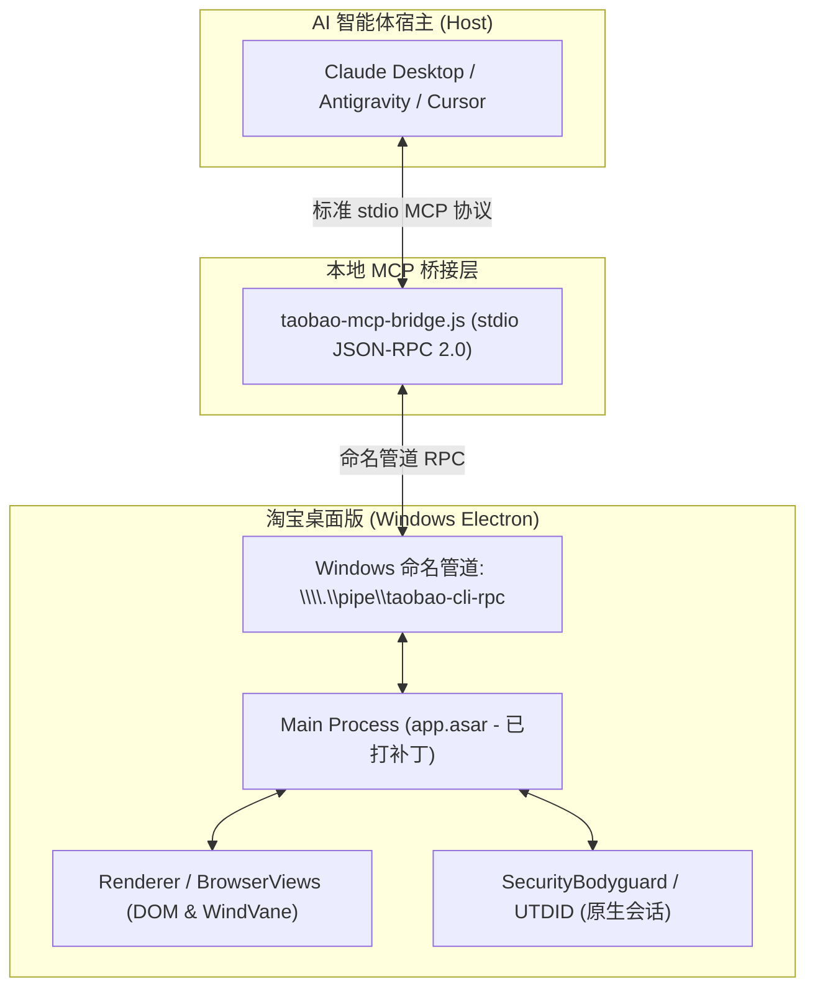

# Taobao Agent (淘宝桌面版 MCP 助手)

<p align="center">
  <a href="README_EN.md">English</a> | <strong>简体中文</strong>
</p>

<p align="center">
  <strong>基于 Model Context Protocol (MCP) 的淘宝 Windows 桌面端智能导购与消费自动化助理</strong>
</p>

<p align="center">
  
  
  
  
  
</p>

---

## 📖 项目简介

`taobao-agent` 是面向消费者与开发者的本地购物助理架构。它通过标准 **Model Context Protocol (MCP)** 将 **淘宝桌面版（Windows Electron 客户端）** 的内部原生能力暴露给 AI 编程助手与自主智能体（包括 Claude Desktop、Google Antigravity、Cursor、Cline 等）。

通过双向命名管道（Named Pipe IPC），智能体能够以高执行自由度完成商品自然语言搜索、多维度比价分析、商详与真实 SKU 价格提取、购物车增删、旺旺商家会话以及售后评价。

---

## 🏗️ 架构概览



---

## ✨ 核心特性

### 1. 原生 MCP 双向桥接 (`taobao-mcp-bridge.js`)
- 基于标准 JSON-RPC 2.0 `stdio` 协议，无缝接入各类 MCP 客户端。
- 30 秒超时防悬挂与 2 秒轻量 Ping 探测机制，确保连接高可用与资源释放。
- 自动唤起守护：检测到客户端未运行时，自动以窗口化最小化模式启动客户端。

### 2. 零字节偏移 ASAR 补丁工具 (`scripts/patch-asar.js`)
通过原位定长字节替换（In-place Binary Patching），不改动 ASAR 文件头或偏移量，实现安全免疫：
- **内测白名单放行（Gatekeeper Bypass，13 字节）**：中和 `if(_0x2505bf)` 云控拦截，解决 `内测期间仅开放部分用户使用` 锁机报错。
- **消费能力解锁（Feature Unblocker，29 字节）**：解除官方在 `function am()` 中对加购、聊天、评价工具的静默压制，原生放行 `add_to_cart`、`open_chat`、`send_chat_message`、`submit_product_rating` 与 `keyboard`。
- **一键原版还原（Restore）**：自动生成 `.original.bak` 备份，随时恢复官方未修改版本。

### 3. 人机协同风控协同协议（Human-in-the-Loop Protocol）
- 自动识别淘宝安全校验与滑块拦截（`安全验证`、`拖动滑块完成验证`、`RGV587_ERROR`、`验证码`）。
- 立即暂停自动化调用，防止频繁重试导致风控升级；主动提示用户在已开启的桌面端窗口完成滑块验证后无缝继续任务。

### 4. 真实 SKU 价格等待机制
- 搜索列表页价格与默认商详价格通常为引流起步价（起步配件价）。
- 智能体严格遵循：**进入商详 $\rightarrow$ DOM 扫描 $\rightarrow$ 精准 Index 点击 SKU $\rightarrow$ 等待 3 秒异步刷新 $\rightarrow$ 读取真实价格**。

### 5. 结构化购物车安全防护
- 购物车扫描支持返回结构化 `cartItems`，包含精确的 `deleteIndex`。
- 严格遵循**不修改/不删除用户既有加购商品**的安全约束，保证资产安全。

---

## 📂 项目结构

```text
taobao-agent/
├── README.md                        # [中文说明文档]
├── README_EN.md                     # [英文说明文档]
├── AGENTS.md                        # 智能体执行准则与工作区治理规范
├── UPSTREAM_SYNC_LOG.md             # 上游热更 Diff 审计与三原则决策日志
├── package.json                     # NPM 脚本与项目元数据
├── taobao-mcp-bridge.js             # Stdio MCP Bridge 连接 \\.\pipe\taobao-cli-rpc
├── skills/                          # 核心智能体技能定义
│   ├── taobao-native/               # 原生执行技能 (v1.0.61 基线)
│   ├── product-search-pipeline/     # 搜索分流与 Slot 提取 (v1.1.4 基线)
│   ├── shopping-recommendation/     # 导购比价策略与 4 层过滤 (v1.0.8 基线)
│   └── procurement-assistant/       # 批量采购与表格解析 (v1.0.62 基线)
└── scripts/                         # 维护与测试工具
    ├── check-diff.js                # 上游技能对比与审计工具
    └── patch-asar.js                # 零偏移 ASAR 补丁与能力解锁工具
```

---

## 🚀 快速上手

### 环境准备
- **操作系统**：Windows 10 / 11 64-bit
- **运行环境**：Node.js >= 18.0.0
- **客户端**：[淘宝桌面版](https://tblifecdn.taobao.com/taobaopc/ai/latest)（默认安装路径位于 `%LOCALAPPDATA%\Programs\taobao\`）

### 1. 克隆代码仓库
```bash
git clone https://github.com/Schrodingers-Neko/taobao-agent.git
cd taobao-agent
npm install
```

### 2. 检查并应用 ASAR 补丁
```bash
# 检查当前客户端补丁状态
npm run patch:status

# 一键应用全部补丁（白名单放行 + 核心工具解锁）
npm run patch:all
```

> **注意**：打补丁前脚本会自动在客户端目录创建 `app.asar.original.bak`。随时可通过 `npm run restore` 还原。

### 3. 启动淘宝桌面版
```bash
# 自动以窗口化且最小化（不打扰用户）模式启动客户端
npm run client:start
```

### 4. 配置 MCP 客户端

在你的 AI 客户端（如 Claude Desktop 或 Antigravity）的 MCP 配置文件中添加：

#### Claude Desktop 配置示例 (`claude_desktop_config.json`)
```json
{
  "mcpServers": {
    "taobao-native": {
      "command": "node",
      "args": [
        "F:/projects/personal/taobao/taobao-mcp-bridge.js"
      ]
    }
  }
}
```

---

## 🛠️ NPM 常用指令

| 命令 | 类型 | 说明 |
| :--- | :---: | :--- |
| `npm run patch:status` | 只读检查 | 检测客户端 `app.asar` 当前是 `ORIGINAL`、`PATCHED` 还是 `UNKNOWN` |
| `npm run patch` | 13 字节补丁 | 仅应用云端内测白名单拦截绕过（Gatekeeper Bypass） |
| `npm run patch:features`| 29 字节补丁 | 仅应用加购、旺旺聊天、打分评价工具解锁（Feature Unblocker） |
| `npm run patch:all` | 完整补丁 | 同时应用白名单绕过与工具解锁补丁 |
| `npm run restore` | 安全回滚 | 将 `app.asar` 从备份无损还原回官方原始二进制文件 |
| `npm run client:start` | 生命周期 | 通过 Windows Shell 启动客户端（窗口化且保持最小化） |
| `npm run diff` | 审计对比 | 检查本地技能与 `%APPDATA%\taobao\` 上游热更之间的 Diff 变动 |
| `npm run declutter:apply -- <patch-id>` | 应用界面精简 | 应用指定分组，保留其他分组，并最小化重启客户端 |
| `npm run declutter:status` | 只读检查 | 检查各分组、备份、已安装文件哈希与恢复状态 |
| `npm run declutter:restore -- <patch-id>` | 安全回滚 | 恢复指定分组，保留其他分组，并最小化重启客户端 |

补丁分为 `home-widgets`（淘江湖、淘宝直播、淘金币）、`search-promotions`（搜索热词与促销标识）和 `main-menu`（帮我挑、逛一逛、采购宝）。使用 `all` 可明确应用或恢复全部三个分组；应用和恢复必须指定目标。下方可选入口通过“全部”菜单管理，迁移时移除此前六个入口的 CSS 隐藏补丁。保留 88VIP、物流、购物车、推荐流设置和原生导航接口。

首页两个分组保留内置样式和原有覆盖文件，共用的新首页 CSS 加载修复仅在两个分组均恢复后移除。ASAR 始终由不可变原始内容和当前启用的分组组合生成；恢复全部分组后，ASAR 与 CSS 回到原始字节或原始不存在状态，保留基线已有的白名单绕过和工具解锁补丁。

新首页只注入带标记的精简规则，保留页面自身的主题样式。首页组件补丁同时隐藏目标组件各自的卡片容器，避免留下空白卡片，并保留 88VIP。搜索精简同时隐藏推广占位层，保留输入框、搜索按钮和独立的桌面搜索文档。重复操作若未改变已安装文件，则不重启客户端。

原始快照和版本化登记文件保存于 `%APPDATA%\taobao\taobao-agent-declutter-backup`。迁移保留已有备份。提交失败自动回滚，中断提交在下次修改命令时恢复。无关的 ASAR/CSS 变更或损坏的备份会阻止安装。状态检查仅验证已安装文件，不代表远程页面选择器的视觉效果已验证。客户端更新可能需要新的兼容基线，不应删除备份来绕过变更检测。独立的 `npm run restore` 仍为整个官方归档的恢复命令，不能用于单个界面分组恢复。

运行 `node scripts/test-declutter.js` 可验证八种组合、独立切换、迁移与恢复流程；添加 `--real` 则对已安装客户端的临时副本验证重建与恢复。

---

## 🛡️ 三原则治理机制 (Three-Way Filter Policy)

淘宝桌面客户端会不定期从官方 CDN 推送内部热更。当检测到上游技能更新时，本项目遵循严格的 **三原则过滤**：

| 分类 | 策略 | 示例 | 处理方案 |
| :--- | :---: | :--- | :--- |
| 🟢 **技术与算法改进** | **采纳 (ADOPT)** | 新的选择器类名（如 `Drawer`）、新 API 字段、超时参数调优、搜索算式 | 经测试后合并至 `skills/` |
| 🔴 **官方合规性削减** | **拒绝 (REJECT)** | “不支持自动填写或提交评价”免责声明、对 `open_chat` / `add_to_cart` 的禁用 | 坚决剔除，完整保留消费者自主权 |
| 🟡 **封闭私有协议** | **转译 (TRANSLATE)** | 封闭云端 A2A 协议（`search_products_a2a`）、私有 JSON 卡片组件 | 转译为标准 MCP 原生工具与 Markdown |

详细审计记录见 [`UPSTREAM_SYNC_LOG.md`](file:///F:/projects/personal/taobao/UPSTREAM_SYNC_LOG.md)。

---

## ⚠️ 免责声明

1. 本项目仅供技术研究、个人无障碍辅助及消费者自主权增强使用。
2. 自动化购物涉及资金交易，请在最终支付与结算环节保持人工核对确认。
3. 请合理控制调用频率，遵守平台服务使用条款。

---

## 📄 开源许可证

本项目基于 [MIT License](LICENSE) 开源。
