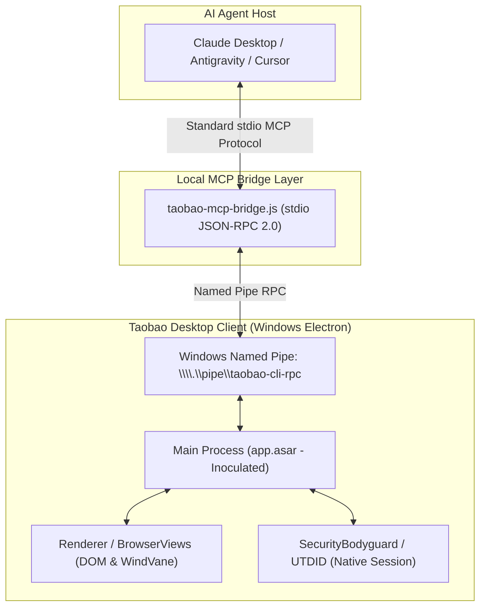

# Taobao Agent (Desktop MCP Assistant)

<p align="center">
  <strong>English</strong> | <a href="README.md">简体中文</a>
</p>

<p align="center">
  <strong>Model Context Protocol (MCP) Bridge & Shopping Automation Assistant for Taobao Windows Desktop</strong>
</p>

<p align="center">
  
  
  
  
  
</p>

---

## 📖 Introduction

`taobao-agent` is an open-source bridge and agentic shopping assistant that connects AI pair programmers and autonomous agents (such as Claude Desktop, Google Antigravity, Cursor, Cline, etc.) to the official **Taobao Desktop client** on Windows via standard **Model Context Protocol (MCP)**.

By communicating with the desktop client's internal Windows Named Pipe RPC endpoint (`\\.\pipe\taobao-cli-rpc`), agents gain high execution autonomy to perform natural language product discovery, multi-dimensional price comparisons, authentic SKU price resolution, non-destructive cart management, merchant customer support messaging, and order rating automation.

---

## 🏗️ Architecture



---

## ✨ Key Features

### 1. Standard stdio MCP Bridge (`taobao-mcp-bridge.js`)
- Exposes all native desktop client tools over standard JSON-RPC 2.0 `stdio`.
- **Resilient IPC**: Configured with a 30-second socket timeout and 2-second ping probes to eliminate orphaned processes and hanging calls.
- **Auto-Launch Guardian**: Automatically starts Taobao Desktop windowed and minimized when calls are received while the client is closed.

### 2. Zero-Byte-Shift ASAR Inoculator (`scripts/patch-asar.js`)
Performs safe, in-place binary patch replacement without modifying header length or byte offsets:
- **Gatekeeper Bypass (13 bytes)**: Neutralizes the cloud closed-beta whitelist check (`if(_0x2505bf)` $\rightarrow$ `if(!1&&false)`), permanently bypassing the `"内测期间仅开放部分用户使用"` lockout message.
- **Feature Unblocker (29 bytes)**: Unsuppresses vendor-disabled tools in `function am()`, unlocking native RPC capabilities for `add_to_cart`, `open_chat` (Wangwang customer support), `send_chat_message`, `submit_product_rating`, and `keyboard`.
- **Pristine Rollback**: Creates an automated `.original.bak` snapshot before any modification, allowing instant bitwise restoration.

### 3. Human-in-the-Loop CAPTCHA Protocol
- Automatically detects security challenges (`安全验证`, `拖动滑块完成验证`, `RGV587_ERROR`, `验证码`).
- Immediately halts automated tool loops to prevent risk escalation or IP throttling.
- Prompts the user to solve the verification slider in the minimized desktop window and seamlessly resumes automation once confirmed.

### 4. Real SKU Price Waiting Rule
- Search result prices and default item page displays represent teaser/starting prices (`起步价`), not actual checkout prices.
- The assistant enforces: **Enter item page $\rightarrow$ DOM element scan $\rightarrow$ Precise index click on SKU $\rightarrow$ Wait 3 seconds (`sleep 3`) for asynchronous price re-calculation $\rightarrow$ Read real price**.

### 5. Non-Destructive Cart Integrity
- Cart element scanning outputs structured `cartItems` with associated `deleteIndex` parameters.
- Built-in governance prevents accidental alteration or deletion of pre-existing cart items.

---

## 📂 Repository Structure

```text
taobao-agent/
├── README.md                        # [Chinese Documentation]
├── README_EN.md                     # [English Documentation]
├── AGENTS.md                        # Workspace guidelines & governance invariants
├── UPSTREAM_SYNC_LOG.md             # Upstream hotfix diff audit & Three-Way Filter log
├── package.json                     # NPM scripts & metadata
├── taobao-mcp-bridge.js             # Stdio MCP Bridge connecting to \\.\pipe\taobao-cli-rpc
├── skills/                          # Core agent skill packages
│   ├── taobao-native/               # Core execution skill (v1.0.61 base)
│   ├── product-search-pipeline/     # Search routing & slot extraction (v1.1.4 base)
│   ├── shopping-recommendation/     # Recommendation strategy & 4-tier filtering (v1.0.8 base)
│   └── procurement-assistant/       # Batch procurement & spreadsheet parsing (v1.0.62 base)
└── scripts/                         # Maintenance and patching utilities
    ├── check-diff.js                # Upstream skill comparison tool
    └── patch-asar.js                # Zero-byte-shift ASAR patch & feature unblocker
```

---

## 🚀 Quick Start

### Prerequisites
- **Operating System**: Windows 10 / 11 64-bit
- **Runtime**: Node.js >= 18.0.0
- **Desktop Client**: [Taobao Desktop Client](https://tblifecdn.taobao.com/taobaopc/ai/latest) (Default installation at `%LOCALAPPDATA%\Programs\taobao\`)

### 1. Clone the Repository
```bash
git clone https://github.com/Schrodingers-Neko/taobao-agent.git
cd taobao-agent
npm install
```

### 2. Inspect and Apply Binary Patches
```bash
# Check current patch status of the client
npm run patch:status

# Apply both Gatekeeper bypass and Feature Unblocker
npm run patch:all
```

> **Note**: An untouched backup (`app.asar.original.bak`) is automatically created before applying any patches. You can revert at any time with `npm run restore`.

### 3. Start Taobao Desktop
```bash
# Starts the client interactively via Windows Shell in a windowed and minimized state
npm run client:start
```

### 4. Configure Your MCP Client

Add the bridge to your MCP client configuration (e.g. Claude Desktop, Antigravity, or Cursor):

#### Claude Desktop Configuration (`claude_desktop_config.json`)
```json
{
  "mcpServers": {
    "taobao-native": {
      "command": "node",
      "args": [
        "F:/projects/personal/taobao/taobao-mcp-bridge.js"
      ]
    }
  }
}
```

---

## 🛠️ NPM Script Reference

| Command | Scope | Description |
| :--- | :---: | :--- |
| `npm run patch:status` | Read-only | Check whether client `app.asar` is `ORIGINAL`, `PATCHED`, or `UNKNOWN` |
| `npm run patch` | 13-byte patch | Apply Gatekeeper cloud whitelist lockout bypass only |
| `npm run patch:features`| 29-byte patch | Apply Feature Unblocker to enable cart, chat, and review tools |
| `npm run patch:all` | Full patch | Apply both Gatekeeper bypass and Feature Unblocker simultaneously |
| `npm run restore` | Rollback | Revert `app.asar` from backup back to official pristine binary |
| `npm run client:start` | Lifecycle | Launch desktop client interactively (windowed & minimized) via Windows Shell |
| `npm run diff` | Audit | Compare local skills with upstream CDN hotfixes in `%APPDATA%\taobao\` |
| `npm run declutter:apply -- <patch-id>` | Apply UI cleanup | Apply one group, preserving the other groups; relaunch minimized |
| `npm run declutter:status` | Read-only | Check each group, backups, installed hashes, and recovery state |
| `npm run declutter:restore -- <patch-id>` | Rollback | Restore one group, preserving the other groups; relaunch minimized |

Patch IDs are `home-widgets` (淘江湖, 淘宝直播, 淘金币), `search-promotions` (search hot words and promo logo), `main-menu` (帮我挑, 逛一逛, 采购宝), and `toolbar` (weather, desktop panda, screenshot button). Use `all` explicitly to apply or restore all four. Apply/restore requires a target. Optional lower sidebar entries are managed through “全部”; the previous six-entry CSS patch is retired during migration. 88VIP, logistics, cart, recommendation-feed settings, and native navigation APIs are preserved.

Use `npm run declutter:apply -- toolbar` or `npm run declutter:restore -- toolbar` to hide or restore those three toolbar controls together. History, settings, more, profile, and window controls stay available, along with the existing screenshot shortcut. Existing three-group registries upgrade automatically while retaining their enabled states and original backups.

The home groups retain bundled styles and any existing overlays. Their shared new-home CSS loader correction stays enabled until both groups are restored. Each archive is composed from immutable original contents plus the enabled groups. Restoring all groups returns the original ASAR and CSS bytes or original absence. Gatekeeper and feature patches present in that baseline remain intact.

On the new home page, the loader injects only the marked patch blocks, preserving the page's own theme. The widget patch hides each target's individual card wrapper too, avoiding empty tiles while retaining 88VIP. Search cleanup also hides the sponsored placeholder overlay; the input, search button, and separate desktop-search document remain intact. Repeating an operation with no installed-file changes does not restart the client.

Original snapshots and the versioned registry are stored under `%APPDATA%\taobao\taobao-agent-declutter-backup`. Migration retains existing backups. Failed commits roll back; interrupted commits recover on the next mutation command. Unrelated archive/CSS changes or invalid backups stop installation. Status verifies installed files, not whether remote page selectors still match visually. Client updates may require a new compatible patch baseline; do not discard backups to bypass drift detection. The separate `npm run restore` remains a full vendor-archive rollback and is not an individual UI-group restore.

Run `node scripts/test-declutter.js` for all sixteen combinations, independent transitions, migration, and recovery checks; add `--real` to rebuild and restore a disposable copy of the installed client. Use `--real-toolbar` for a focused full-client toolbar apply/restore check that verifies the other groups and CSS are preserved.

---

## 🛡️ Three-Way Filter Governance

The desktop client receives proprietary hotfixes via Alibaba CDN to `%APPDATA%\taobao\`. When newer upstream skill versions are detected, this workspace evaluates changes according to the **Three-Way Filter Policy**:

| Category | Policy | Examples | Action |
| :--- | :---: | :--- | :--- |
| 🟢 **Technical & Algorithmic** | **ADOPT** | Updated DOM selectors (`Drawer` classes), new API response fields, timeout tuning, ranking formulas | Merge into active skills under `skills/` |
| 🔴 **Corporate Compliance** | **REJECT** | Disclaimers such as *"ratings not supported"*, intentional bans on `open_chat` or cart DOM automation | Firmly discard; preserve all consumer capabilities |
| 🟡 **Internal Closed Protocols** | **TRANSLATE** | Cloud-only A2A endpoints (`search_products_a2a`), proprietary JSON UI cards (`---a2ui_JSON---`) | Translate into standard MCP tool calls and clean Markdown |

Audit decisions are tracked in [`UPSTREAM_SYNC_LOG.md`](file:///F:/projects/personal/taobao/UPSTREAM_SYNC_LOG.md).

---

## ⚠️ Disclaimer

1. This project is intended solely for research, accessibility enhancements, and personal consumer automation.
2. E-commerce operations involve real financial transactions. Always manually verify orders and totals prior to final payment and checkout.
3. Use reasonable request intervals to respect platform terms of service.

---

## 📄 License

This project is licensed under the [MIT License](LICENSE).
